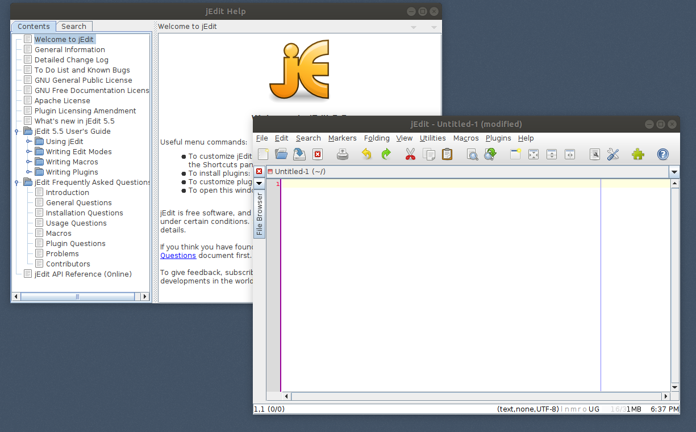
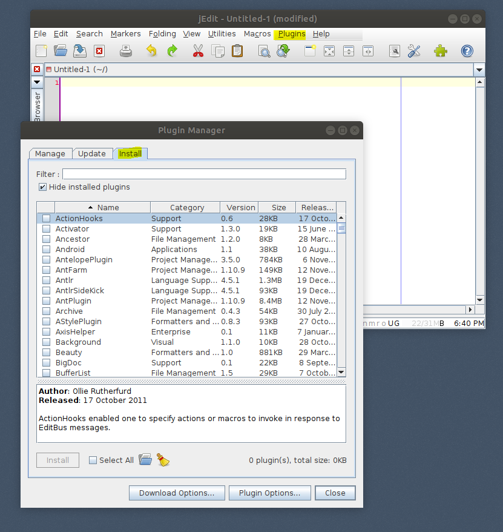
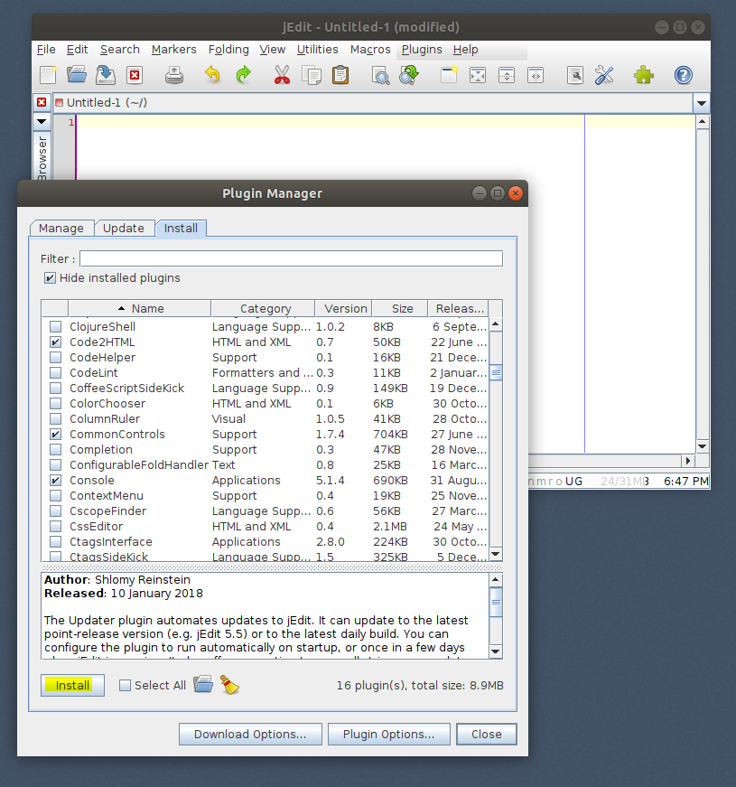
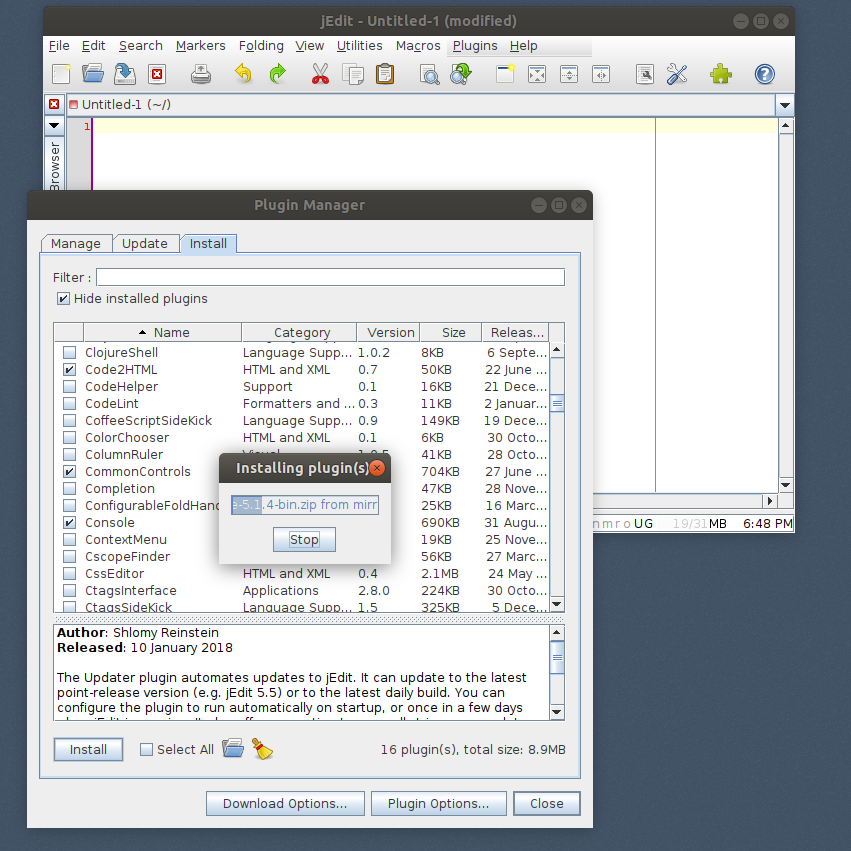
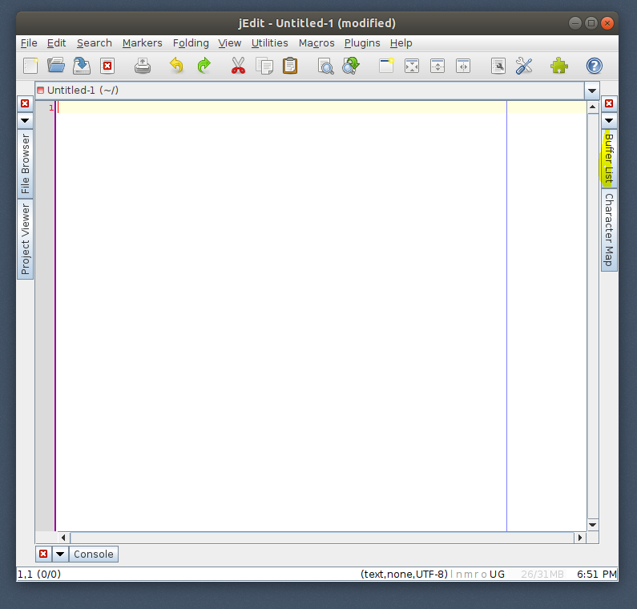
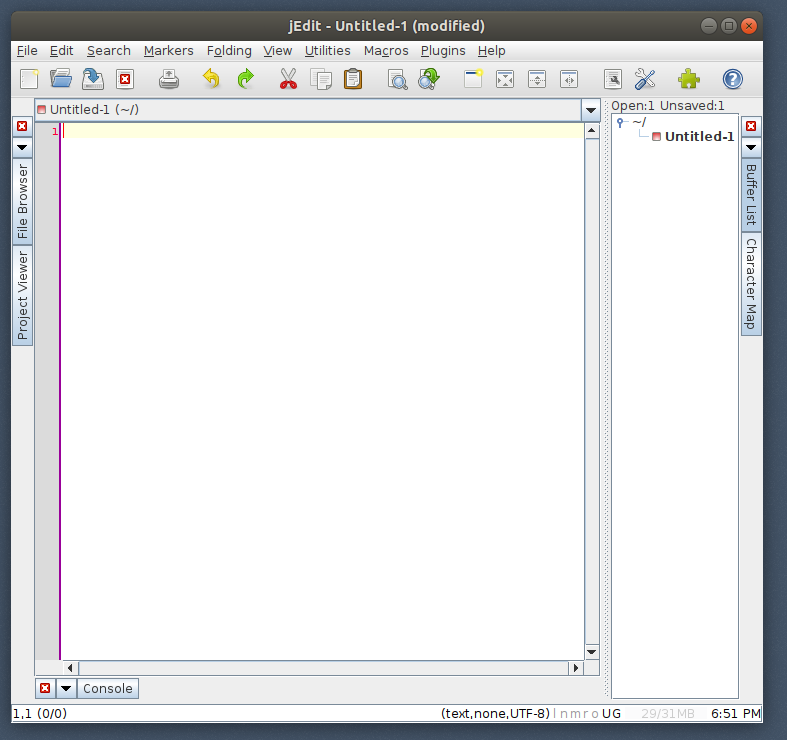
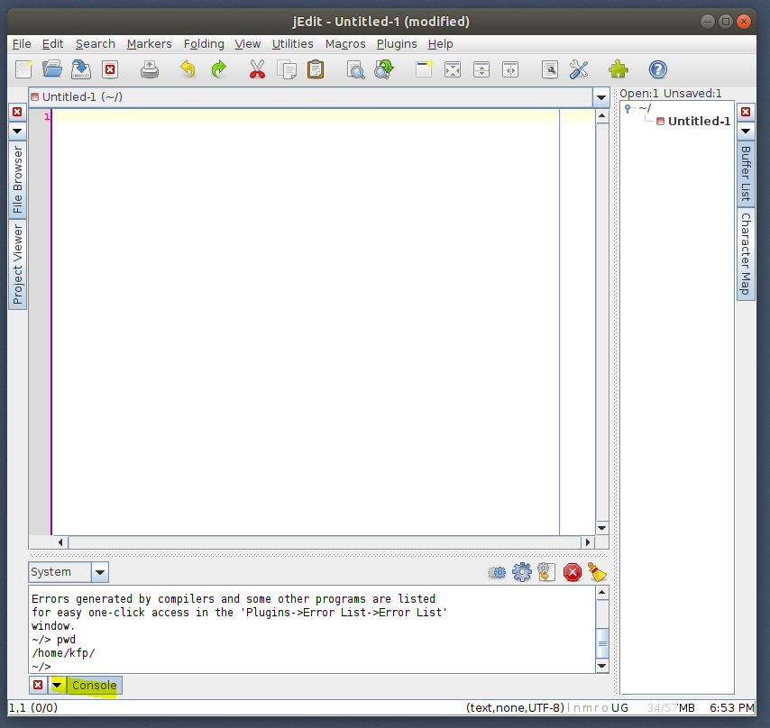
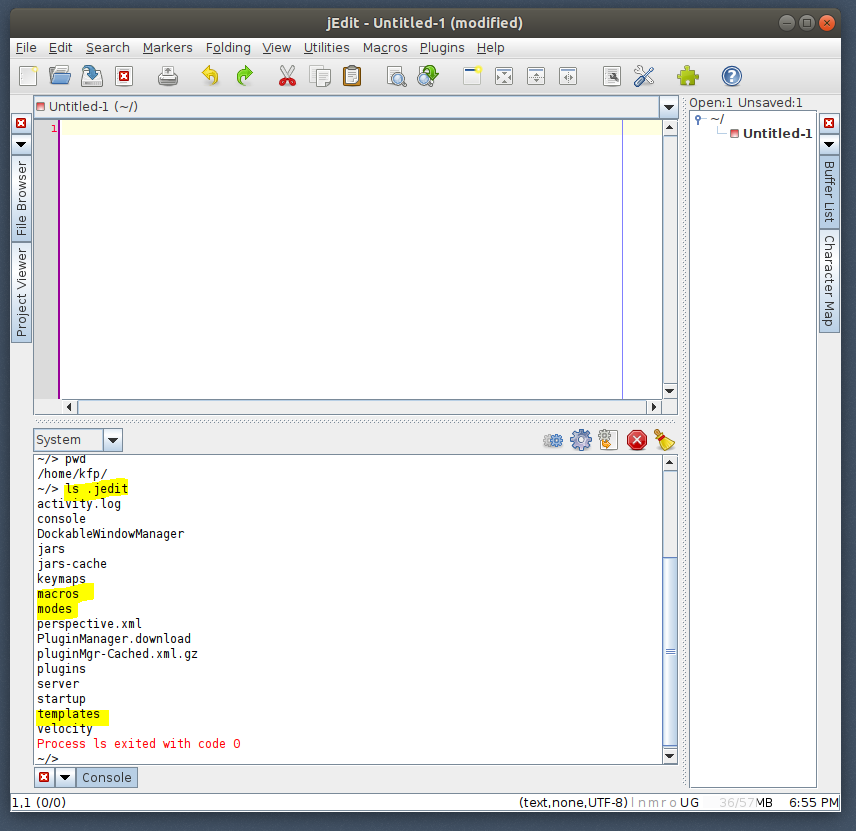
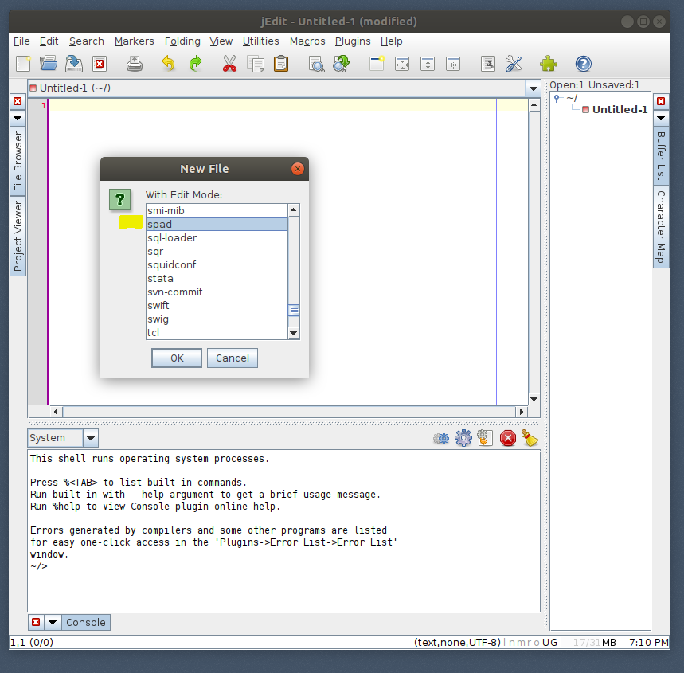
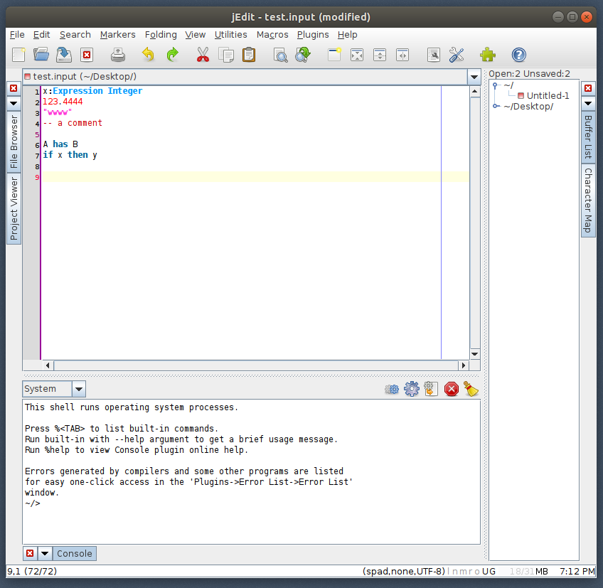

Install jEdit
=============

::

  $ sudo apt install jedit 
  
  $ apt list jedit 
  Listing... Done
  jedit/bionic,bionic,now 5.5.0+dfsg-1 all [installed]
  
  $ jedit -version
  jEdit 5.5.0
  $ jedit -usage

Start jEdit ::

  $ jedit &

  

  

  

  

BufferList
CharacterMap
Code2HTML
ImageViewer
InfoViewer
JDiffPlugin
MarkdownPlugin
SpellCheck

Console
ContextMenu
ProjectViewer
Templates
TextFilter
GnuRegexp

$ cp -v spad.xml ~/.jedit/modes/

<MODE NAME="spad" FILE="spad.xml" FILE_NAME_GLOB="*.{spad,input}" />

$ export jcat_tmp=~/.jedit/modes/catalog
$ cat $jcat_tmp add_spad_to_catalog.txt > $jcat_tmp

open new in mode spad

right-click -> customize this (jedit 11)

Plugins -> Plugin Options -> Console -> Compile & Run

$ cp -v templates/spad_* ~/.jedit/templates/
'templates/spad_category.vm' -> '/home/kfp/.jedit/templates/spad_category.vm'
'templates/spad_domain.vm' -> '/home/kfp/.jedit/templates/spad_domain.vm'
'templates/spad_package.vm' -> '/home/kfp/.jedit/templates/spad_package.vm'
'templates/spad_unittest.vm' -> '/home/kfp/.jedit/templates/spad_unittest.vm'

$ mkdir ~/.jedit/macros/FriCAS
$ cp -v  macros/fricas_api.bsh ~/.jedit/macros/FriCAS 
'macros/fricas_api.bsh' -> '/home/kfp/.jedit/macros/FriCAS/fricas_api.bsh'

